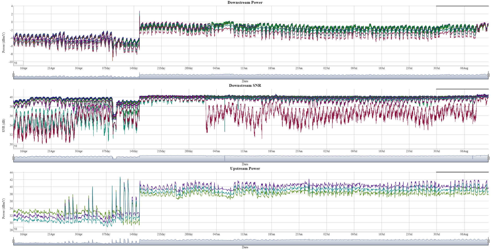

<H1> Cable Modem Data, how to record and plot, simplified</H1>

2017-04-13 paul chevalier

<b> Select the image to present a live instance using files in this repository. Try out the rolling average entries(default=10), and use the range selector bars under each graph to move around and zoom in the timeline. (note that the page auto-refreshes every 5 mnutes)</b>

<b>The Goal:</b> 
Record statistics from an Arris SB6183 cable modem, and plot the results in realtime. 

<b>Overview:</b> 
<ul>
<li>Periodically run the cableModemCapture-SB6183.sh shell script via cron.</li>
<li>The script uses the lynx text-based web browser to capture all data from the cable modem.</li>
<li>It parses the data to extract target numerical data.</li>
<li>Then timestamps the numerical data and appends it to running CSV data files.</li>
<li>Graphic plots of the accumulated data are produced in realtime.</li>
</ul>

<b>Requirements/Dependencies:</b> 
<ul>
<li>An Arris SB6183 cable modem to capture data from</li>
<li>A linux instance, or equivalent
<li>dygraph-combined.js  (ref:  <a href="http://dygraphs.com">Dygraphs</a>
 )</li>
<li>A local web server(optional) running on the linux instance</li>
</ul>

<b>Operational files:</b> 
<ul>
<li>cableModemCapture-SB6183.sh  (typically run every 5 minutes via cron)</li>
<li>index.html</li>
<li>dygraph-combined.js</li>
<li>crontab entry</li>
</ul>

<b>Data files: three running csv data files are appended to every time the script is run:</b>

<ul>
<li>DownPowerLevels.csv </li>
<li>SNR-Levels.csv</li>
<li>UpPowerLevels.csv</li>
</ul>

The index.html  file references those csv files, and uses dygraphs to produce graphic plots.  

A recommended implementation is to run this off a Raspberry-pi, as it’s useful for portability and low power consumption. (most any host system can use this method, it only uses a basic shell, lynx, sed, grep, cut, dygraphs, and a scheduler)

Example file structure on Raspberry-pi:

/var/www/html

├── dygraph-combined.js 
├── index.html 
├── SB6183 
│   ├── CableModemCapture-SB6183.sh 
│   ├── cronout-stats.txt 
│   ├── DownPowerLevels.csv 
│   ├── SNR-Levels.csv 
│   └── UpPowerLevels.csv 

example crontab -l : 
0,5,10,15,20,25,30,35,40,45,50,55 * * * *  /bin/bash /var/www/html/SB6183/CableModemCapture-SB6183.sh
 

While the parsing parameters in the capture script are specific to an Arris SB6183 cable modem, they can easily be modified for other modems or devices that can produce a repeatable pattern of data via a URI.  To do that, use lynx to dump a text file of the target device data.  Then open the text file in an appropriate editor (e.g. notepad++) to easily determine the line numbers and field identifiers of the target data, and then adjust the parsing parameters in the capture script.
 
 

A typical parse event in the script performs this sequence on the lynx-captured dump file:
 
<ul>
<li> use sed to trim to a target range of line numbers:  <pre><i><b> sed -n '23,38 p' </i></b></pre> </li>
<li> grep for lines with a target text identifier: <pre><i><b> grep dBmV </i></b></pre> </li>
<li> use sed to shrink multiple whitespace to one: <pre><i><b> sed 's/   */ /g' </i></b></pre> </li>
<li> use cut with a whitespace delimiter and extract the target field of numerical data: <pre><i><b> cut -d" " -f 10 </i></b></pre> </li>
<li> use sed to transpose the extracted data into a single csv line: <pre><i><b> sed -e :a -e '/$/N; s/\n/,/; ta'  </i></b></pre> </li>
<li> append the timestamped csv line to the target cumulative csv file </li>
</ul>

 
 

Note that running a web server is only needed if you want to view the plots from a browser on your lan(preferred) , but you could just view the plots using firefox pointing to the index.html file. (note that the non-web server method doesn’t work with Chrome browser because it disallows cross origin requests)

 
Range selectors and rolling average entries are available in the graphs (see index.html).
Rolling averages use a default of 10.
 
 

